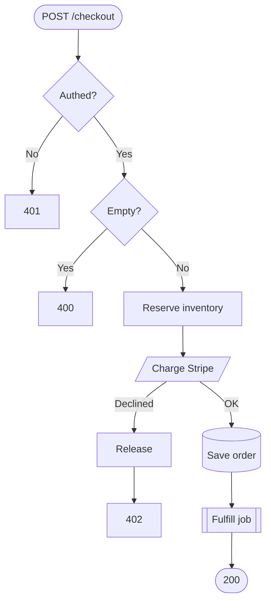
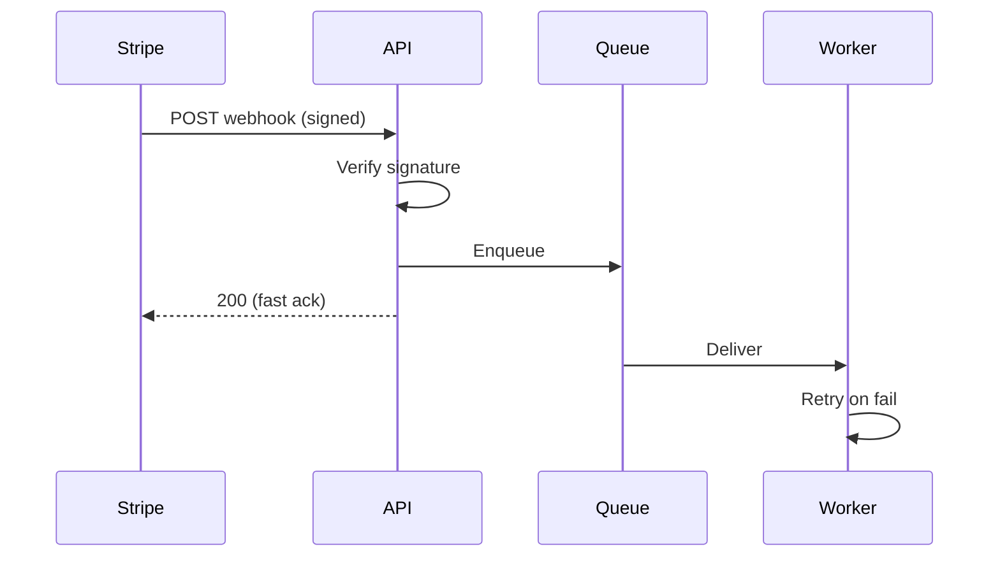

# Visuals

Produce a text diagram + a short written walkthrough. Mermaid by default. ASCII on request. The diagram shows shape; the words explain purpose — always include both, because without the written part the reader has to do the translation.

## Flags

- `--ascii` — force ASCII
- `--type <flowchart|sequence|state|class|erd>` — force diagram type
- `--save <path>` — write a single `.md` file to `<path>` containing the fenced mermaid block followed by the written walkthrough
- `--detail <low|med|high>` — granularity (default `med`)

## Steps

1. **Get the source.**
   - Named code (file, function, route) → read it.
   - Ambiguous location → grep for likely entry points and ask the user which one.
   - No code (proposed architecture, pseudo-code, verbal description) → diagram from the user's description; ask a targeted clarifying question only if a branch or actor is unclear.
2. **Trace** entry → branches → side effects → exit.
3. **Pick the type** that fits (see table). Claude picks; no need to ask first.
4. **Draw.** Keep nodes ≤ ~9 (readers hold ~7 ± 2 in working memory). If the flow exceeds ~15 nodes even at `--detail low`, collapse subsystems into single nodes (`[[Worker subsystem]]`) and suggest the user run `/visuals <subsystem>` to go one level deeper.
5. **Write the walkthrough** — 3–6 sentences naming the business purpose, not the code. Always include it; if the user says "just the diagram," still add 1–3 sentences.

## Pick the type

| Code shape | Type |
|---|---|
| Branches, decisions, loops | `flowchart` |
| Services/actors exchanging messages | `sequence` |
| Entity lifecycle / statuses | `state` |
| Data model / tables | `erd` |
| Type hierarchies | `class` |

## Mermaid conventions

- Shapes carry meaning: `([Start])`, `{Decision?}`, `[(DB)]`, `[[Subsystem]]`, `[/External/]`
- Label decision edges: `-- Yes -->`, `-- Not found -->`
- Use `subgraph` for service/module boundaries
- `TD` default; `LR` when wide and shallow
- Name nodes with the **business verb** (`Charge card`), not the function (`stripe_charge()`) — the diagram's job is to explain *why*, not mirror code

## ASCII fallback

Use `─ │ ┌ ┐ └ ┘ ├ ┤ ┬ ┴ ┼ ▼ ▲ ►`. Align and keep it simple.

## Detail levels

- `low` — 3–5 nodes, happy path only
- `med` — happy path + key branches + side effects (default)
- `high` — all branches, errors, retries

Start lower when unsure. A diagram that fits on screen beats a thorough one nobody reads.

## Examples

### Flowchart — request path

````markdown


Turns a cart into a paid order. Inventory is reserved *before* charging to avoid overselling; if the charge fails we release the reservation — that's the branch most likely to leak inventory. Fulfillment is async so the response doesn't block on warehouse APIs.
````

### Sequence — multi-service

````markdown


Signature is verified synchronously so tampered requests get rejected fast; real work runs async so we ack Stripe quickly and the worker can absorb DB slowness without losing events.
````

### State — lifecycle

````markdown
```mermaid
stateDiagram-v2
    [*] --> Pending
    Pending --> Paid: charge ok
    Pending --> Cancelled: timeout/user
    Paid --> Fulfilled: shipped
    Paid --> Refunded
    Fulfilled --> Returned --> Refunded
    Cancelled --> [*]
    Refunded --> [*]
    Fulfilled --> [*]
```

Terminal states (`Cancelled`, `Refunded`, `Fulfilled`) have no exits — that's what makes auditing clean. Refunds can come from `Paid` directly or via `Returned`.
````

## Avoid

- Code-in-boxes — function names instead of business verbs
- One giant diagram — collapse to subsystems past ~15 nodes
- Flowchart reflex — sequence/state are often clearer
- Skipping the walkthrough
- Hallucinating branches — if unsure, read or ask
